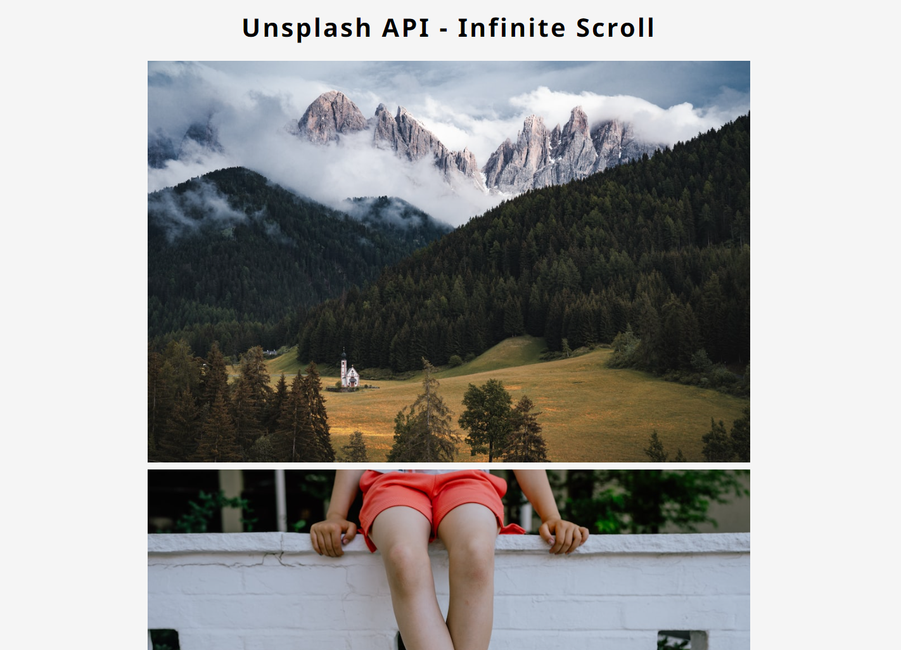

<!-- ## Welcome to GitHub Pages
/*
You can use the [editor on GitHub](https://github.com/rob3rt96/rob3rt96.github.io/edit/main/README.md) to maintain and preview the content for your website in Markdown files.

Whenever you commit to this repository, GitHub Pages will run [Jekyll](https://jekyllrb.com/) to rebuild the pages in your site, from the content in your Markdown files.

### Markdown

Markdown is a lightweight and easy-to-use syntax for styling your writing. It includes conventions for

```markdown
Syntax highlighted code block

# Header 1
## Header 2
### Header 3

- Bulleted
- List

1. Numbered
2. List

**Bold** and _Italic_ and `Code` text

[Link](url) and 
```

For more details see [Basic writing and formatting syntax](https://docs.github.com/en/github/writing-on-github/getting-started-with-writing-and-formatting-on-github/basic-writing-and-formatting-syntax).
-->

# Infinite Scroll

## Description:

I created a **photo displaying** app that will show and reload more pictures after you hit the bottom of the page. 
For this project I required knowledge about DOM, javascript fetch(), Promises, async/await, etc.

## Technologies used:

For this app I used "**Unsplash API**" of https://unsplash.com/documentation to gather the random photos, and then load them in the page.



