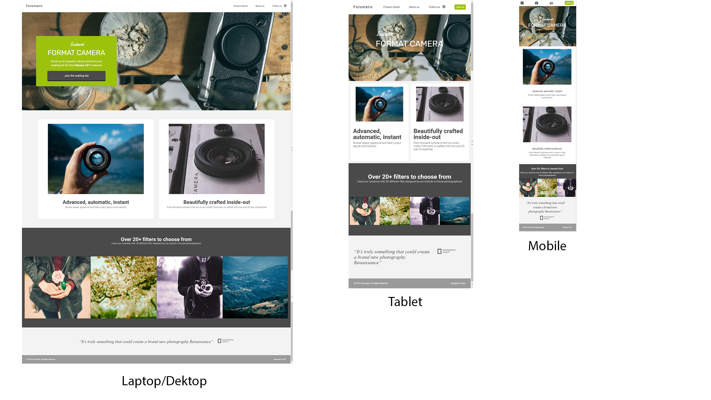

# Fotomatic

You can check the website on this link: <a href="https://rob3rt96.github.io/Fotomatic_project/" target="_blank">https://rob3rt96.github.io/Fotomatic_project/</a>

The site is responsive to resolutions of max-width: 450px (mobile), max-width: 760px (tablet) or anything beyond 760px in width.

